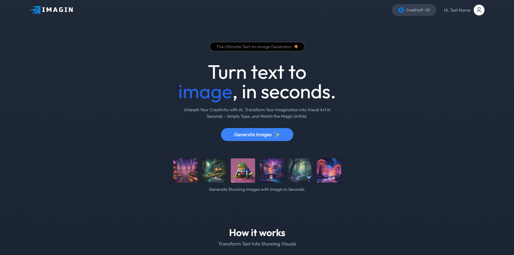
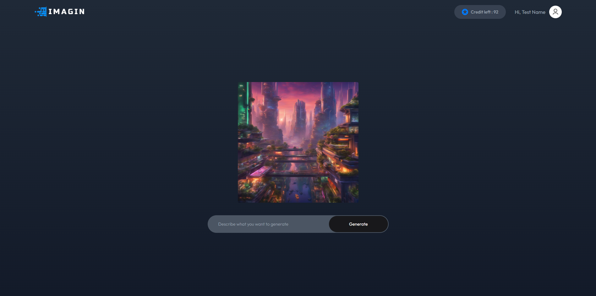
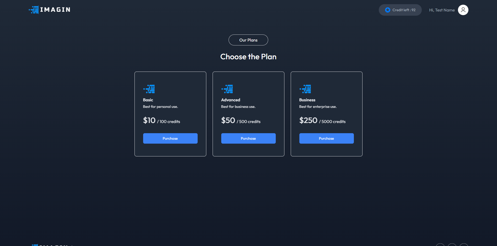
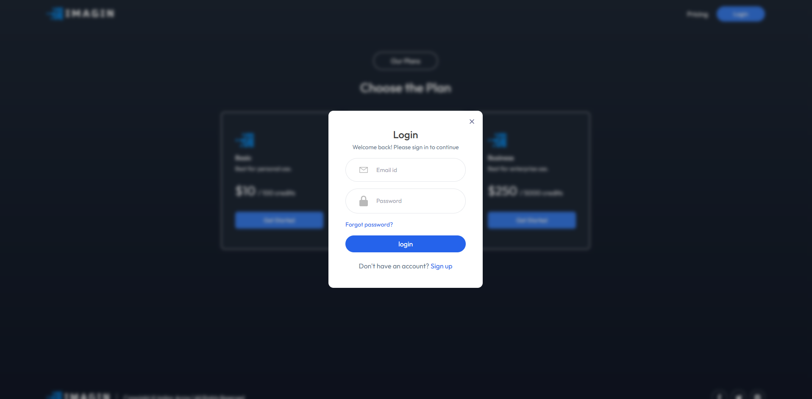

🎨 Imagin - AI Text to Image Generator
Imagin is an **AI-powered text-to-image generator** that turns written descriptions into stunning, high-quality images. Built with the **MERN stack**, this app allows users to input text and generate unique visuals, unlocking endless creative possibilities.

## 🚀 Features

- **AI-Powered Image Generation**: Generate realistic and creative images from text prompts using advanced AI models.
- **User-Friendly Interface**: Simple, clean, and intuitive UI built with React and Tailwind CSS.
- **Fast & Efficient**: Quick image generation with minimal waiting time.
- **Customizable**: Allows users to tweak parameters for varied results and styles.
- **Full-Stack Solution**: Built with the MERN stack (MongoDB, Express.js, React, Node.js).

## 🔧 Technologies Used

- **Frontend**: React, Tailwind CSS
- **Animation**: Motion
- **Backend**: Node.js, Express.js
- **Database**: MongoDB
- **API**: Clipdrop API

## 🖼️ How It Works

1. **Enter Text Description**: Type in a detailed description of the image you want to generate.
2. **Generate Image**: The app sends the prompt to an AI model Clipdrop, processes it, and returns an image based on your description.
3. **Download Image**: Once the image is generated, you can download it for use.

## 📦 Installation & Setup

1. Clone the repository:

   ```bash
   git clone https://github.com/Imtiaz4530/Imagin
   ```

2. Install dependencies for the frontend:

   ```bash
   cd client
   npm install
   ```

3. Install dependencies for the backend:

   ```bash
   cd server
   npm install
   ```

4. Create a `.env` file in the frontend directory and add the following:

   ```
   VITE_BACKEND_URL = <Your BACKEND URI>
   ```

5. Create a `.env` file in the backend directory and add the following:

   ```
   MONGO_DB_URI=<Your MongoDB URI>
   JWT_SECRET=<Your JWT Secret>
   PORT=<Your backend port>
   CLIPDROP_API=<Your Clipdrop API>
   STRIPE_SECRET_KEY=<Your stripe secret key >
   ```

6. Run both frontend and backend:
   ```bash
    npm run dev
   ```

## Screenshots






## Contributing

Contributions are welcome! Feel free to open issues or submit pull requests to improve the Imagin AI.
